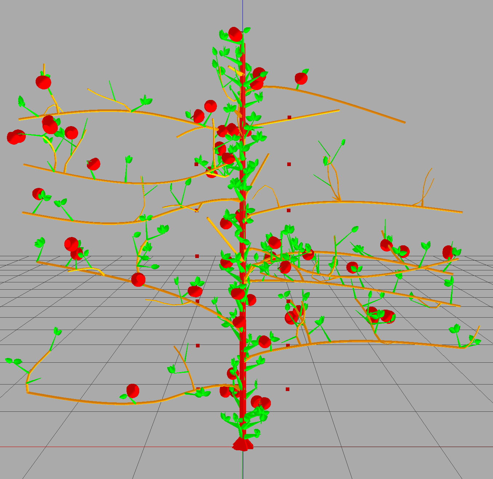

============
TreeSim_Lpy
============

Description
-----------

TreeSim_Lpy is a tree modelling tool which is built upon L-py with the added features of pruning and tying trees down to mimic different architectures. The tool uses python and prior knowledge of L-systems and L-Py is needed to work with this tool. This tool is ideal for researchers and developers working on botanical simulations and robotic harvesting applications.

Python version 3.9

Table of Contents
-----------------

- `Installation <#installation>`__
- `Tutorials <#tutorials>`__
- `Usage <#usage>`__
- `Features <#features>`__
- `Contributing <#contributing>`__
- `License <#license>`__
- `Contact <#contact>`__
- `Acknowledgments <#acknowledgments>`__

Documentation
-------------

The documentation is provided at `Read the Docs <https://treesim-lpy.readthedocs.io/en/latest/>`__.

You can find the latest L-Py documentation at <https://lpy.readthedocs.io/en/latest>

Installation
------------

To install TreeSim_Lpy, follow these steps (adapted from the `L-Py documentation <https://treesim-lpy.readthedocs.io/en/latest/installation.html>`__):

1. **Install Conda**:
   
   The L-Py distribution relies on the conda software environment management system. If you do not already have conda installed, you can find installation instructions on the `Conda Installation Page <https://docs.conda.io/projects/conda/en/latest/user-guide/install/>`__.

2. **Create a Conda Environment**:

   Create an environment named `lpy`:
   
   .. code-block:: sh

      conda create -n lpy openalea.lpy -c fredboudon -c conda-forge

   The package is retrieved from the `fredboudon` channel (development), and its dependencies will be taken from the `conda-forge` channel.

3. **Activate the L-Py Environment**:

   .. code-block:: sh

      conda activate lpy

4. **Install Required Packages**:

   .. code-block:: sh

      pip install -r requirements.txt

5. **Run L-Py**:

   .. code-block:: sh

      lpy

Tutorials
---------

There are many things you may want to modify as you grow your own trees. Here are some tutorials for some of the more common changes:

1. **Changing Apple Geometry:**
   
   The call production of the apples happens in the ``grow_object(o)`` section:

   .. code-block:: python

       elif 'Apple' in o.name:
           produce [S(.1/2, .09/15)f(.1)&(180)A(.1, .09)]
   
   

   The apple's base is generated with the ``A(bh, r)`` production rule seen below. 

   .. code-block:: python
      
      A(bh, r):
          curves = make_apple_curve()
          base_curve = curves[0]
          top_curve = curves[1]
          nproduce SetColor(230,0,0) SectionResolution(60)
          produce nF(bh, .01, r, base_curve) ^(180) nF(bh/5, .1, r, top_curve)^(180)
   
   The parameters represent the base height of the apple and the radius of the apple. If you wanted to create a completely new apple geometry, just replace the code in this A section. However, if you simply want to edit the existing shape of the apple, that can be done in the ``make_apple_curve()`` section. 

   The apple is made with two curves: a curve that marks the base of the apple, and a curve that marks the indentation on top of the apple. These curves are generated as different Curve2D objects, then turned into QuantisedFunction objects. This is necessary because of the way the apple is produced ``nF``. ``nF`` has an optional parameter ``radiusvariation`` which must be a quantized function. ``nF`` produces a cylinder in n steps, and these curves work by specifying how large the radius for the cylinder should be at each step.
   
   Currently, the stem is produced separately from the apple base. The stem is created in a slightly different way than the apple. A NurbsCurve2D object is returned from the ``make_stem_curve()`` function. This curve is used in ``SetGuide`` to mark how the stem will be generated. ``nF`` is used to follow the guide while generating a cylinder, and there is no ``radiusvariation`` this time.

   .. code-block:: python

       S(sh,r):
           stem_curve = make_stem_curve()
           nproduce SetColor(100,65,23) 
           produce  SetGuide(stem_curve, sh) _(r)nF(sh, .1, r)

2. **Changing Leaf Geometry:**

   .. code-block:: python

      L(l):
          nproduce SetColor(0,225,0) 
  
          curves = make_leaf_guide()
          curve1 = curves[0]
          curve2 = curves[1]
  
          produce _(.0025) F(l/10){[SetGuide(curve1, l) _(.001).nF(l, .01)][SetGuide(curve2, l)_(.001).nF(l, .01)]}

3. **Changing Bud Geometry:**
   
   .. code-block:: python

      spiked_bud(r):
          base_height = r * 2
          top_height = r * 2
          num_sect = 20
          produce @g(Cylinder(r,base_height,1,num_sect))f(base_height)@g(Cone(r,top_height,0,num_sect))

4. **Changing Branch Profile Curve:**

   .. code-block:: python

      # From grow_object(o)
      if 'Trunk' in o.name or 'Branch' in o.name:
        nproduce SetContour(o.contour)
      else:
        # set the contour back to a usual circle
        reset_contour()

5. **Changing Tertiary Branch Curves:**

   .. code-block:: python

      # From bud(t)
      if 'NonTrunk' in new_object.name:
         import time
         curve = create_bezier_curve(seed_val=time.time())
         nproduce [SetGuide(curve, new_object.max_length)

6. **Changing color ID system:**

   .. code-block:: python

      # From grow_object(o)
      r, g, b = o.color
      nproduce SetColor(r, g, b)
      
      smallest_color = [r, g, b].index(min([r, g, b]))
      o.color[smallest_color] += 1

7. **Changing Apple and Leaf ratio:**
   
   .. code-block:: python

      # From Spur class
      def create_branch(self):
          if self.num_leaves < self.max_leaves: 
              self.num_leaves += 1
              if rd.random()<0.9:
                  new_ob = Leaf(copy_from = self.prototype_dict['leaf'])
              else:
                  new_ob = Apple(copy_from = self.prototype_dict['apple'])
          else: 
              new_ob = None
          
          return new_ob

Features
--------

- **Pruning:** Remove unwanted branches to simulate pruning.
- **Branch Tying:** Simulate branches being tied down to mimic different orchard architectures.
- **Model Class Types:** The model generated is built with classes of different material type. 

========
Gallery
========

   
   Example of a labelled, pruned and tied envy tree system using TreeSim_Lpy
  
  

.. figure:: media/ufo.png
   :width: 500
   :height: 300
   
   Example of a labelled, pruned and tied UFO tree system using TreeSim_Lpy

Contact
-------

For any questions or issues, please contact us through **GitHub Issues**. 

Help and Support
----------------

Please open an **Issue** if you need support or you run into any error (Installation, Runtime, etc.).
We'll try to resolve it as soon as possible.

==============
Citations
==============

   - F. Boudon, T. Cokelaer, C. Pradal, P. Prusinkiewicz and C. Godin, L-Py: an L-system simulation framework for modeling plant architecture development based on a dynamic language, Frontiers in Plant Science, 30 May 2012.

