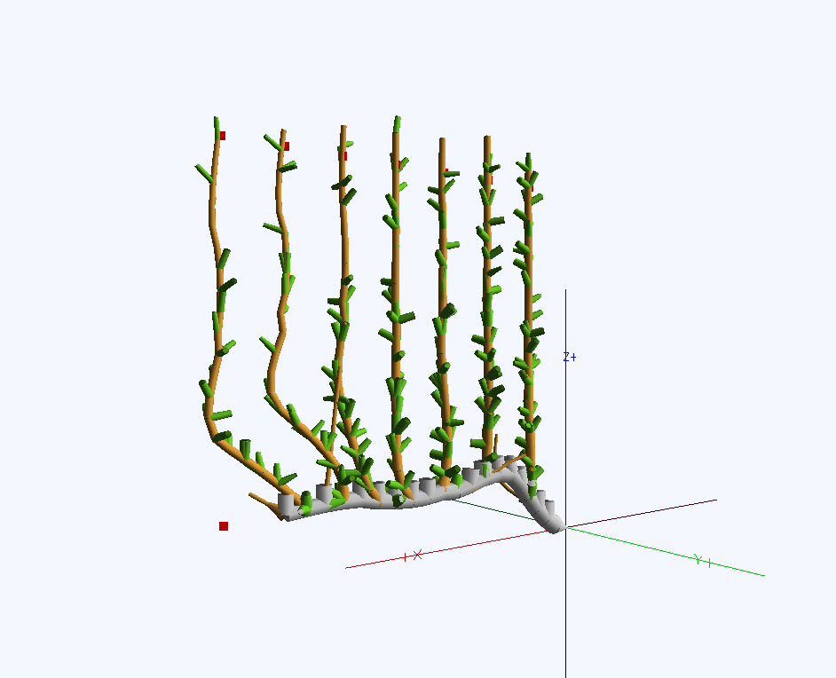

============
TreeSim_Lpy
============

Description
-----------

TreeSim_Lpy is a tree modelling tool which is built upon L-py with the added features of pruning and tying trees down to mimic different architectures. The tool uses python and prior knowledge of L-systems and L-Py is needed to work with this tool. This tool is ideal for researchers and developers working on botanical simulations and robotic harvesting applications.

Python version 3.9

Table of Contents
-----------------

- `Installation <#installation>`__
- `Usage <#usage>`__
- `Features <#features>`__
- `Gallery <#gallery>`__
- `Contact <#contact>`__
- `Support <#support>`__
- `Citations <#citations>`__

Documentation
-------------

The documentation is provided at `Read the Docs <https://treesim-lpy.readthedocs.io/en/latest/>`__.

You can find the latest L-Py documentation at <https://lpy.readthedocs.io/en/latest>

Installation
------------

To install TreeSim_Lpy, follow these steps (adapted from the `L-Py documentation <https://treesim-lpy.readthedocs.io/en/latest/installation.html>`__):

1. **Install Conda**:
   
   The L-Py distribution relies on the conda software environment management system. If you do not already have conda installed, you can find installation instructions on the `Conda Installation Page <https://docs.conda.io/projects/conda/en/latest/user-guide/install/>`__.

2. **Create a Conda Environment**:

   Create an environment named `lpy`:
   
   .. code-block:: sh

      conda create -n lpy openalea.lpy -c fredboudon -c conda-forge

   The package is retrieved from the `fredboudon` channel (development), and its dependencies will be taken from the `conda-forge` channel.

3. **Activate the L-Py Environment**:

   .. code-block:: sh

      conda activate lpy

4. **Install Required Packages**:

   .. code-block:: sh

      pip install -r requirements.txt

5. **Run L-Py**:

   .. code-block:: sh

      lpy

6. **Install TreeSim_Lpy**:

   With the conda environment for L-Py set, next we need to clone the TreeSim_Lpy repository. To do that run

   .. code-block:: sh

      git clone https://github.com/OSUrobotics/treesim_lpy.git

Usage
-----

Here is a basic usage example to get you started:

- **Loading a Tree Model:**

   .. code-block:: python

      Do some lpy things
      More lpy code
      produce something?

Features
--------

- **Pruning:** Remove unwanted branches to simulate pruning.
- **Branch Tying:** Simulate branches being tied down to mimic different orchard architectures.
- **Model Class Types:** The model generated is built with classes of different material type. 

========
Gallery
========
.. figure:: media/envy_model.png
   :width: 500
   :height: 300
   
   Example of a labelled, pruned and tied envy tree system using TreeSim_Lpy
  
  

   
   Example of a labelled, pruned and tied UFO tree system using TreeSim_Lpy

Contact
-------

For any questions or issues, please contact us through **GitHub Issues**. 

Support
----------------

Please open an **Issue** if you need support or you run into any error (Installation, Runtime, etc.).
We'll try to resolve it as soon as possible.

==============
Citations
==============

   - F. Boudon, T. Cokelaer, C. Pradal, P. Prusinkiewicz and C. Godin, L-Py: an L-system simulation framework for modeling plant architecture development based on a dynamic language, Frontiers in Plant Science, 30 May 2012.

